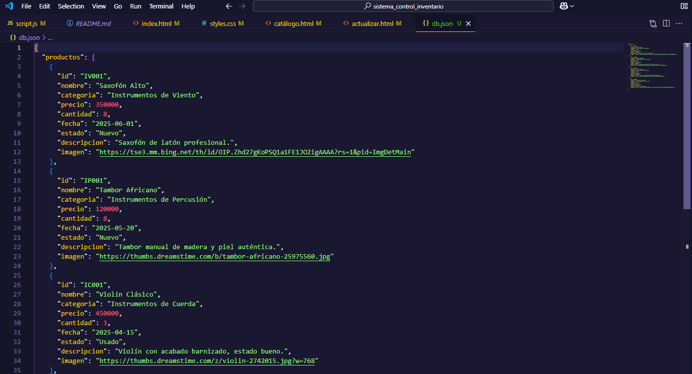

# Sistema de Inventario para Tienda Musical

  
  


> Sistema de control de inventario para una tienda musical. Permite agregar, visualizar y editar productos de manera dinámica utilizando HTML, CSS y JavaScript con persistencia de datos a través de una API local (`json-server`).

  
  


---

## Evolución del Proyecto

### 📍 Fase 1 – Versión Inicial: localStorage

**Objetivo:**  
Crear una aplicación de inventario funcional usando HTML, CSS y JavaScript con almacenamiento en el navegador.

**Características principales:**
- Uso de `localStorage` para guardar productos.
- 🔑 Map(): fue utilizada para almacenar los productos en forma de clave-valor, lo que permitió acceder a los datos de manera ordenada y rápida.
- 🛡️ Set(): se implementó para evitar la repetición de productos, garantizando que no se añadieran duplicados al inventario.
- 🔁 for...in y for...of: se emplearon para recorrer objetos y colecciones.
- Página única (`index.html`) con formulario y listado de productos.
- Interfaz básica sin conexión a servidor.
- Código simple en un solo archivo JS.
Estas herramientas, entre algunas otras, me ayudaron a reforzar conceptos de lógica, estructuras de datos y manipulación eficiente del DOM con JavaScript Vanilla.

**Tecnologías:**  
`HTML`, `CSS`, `JavaScript ES6`, `localStorage`

---

### 🚀 Fase 2 – Refactorización con Servidor Local (API con JSON Server)

**Motivación:**  
Actualizar el proyecto por requerimientos académicos, simulando una API real para mejorar la estructura y lógica del código, eliminando completamente `localStorage`.

**Cambios fundamentales:**
✅ Reemplazo de `localStorage` por peticiones HTTP a un **servidor local (`json-server`)**  
✅ Uso de `fetch()` para consumir y manipular los datos desde `/db.json`  
✅ Archivo `db.json` como base de datos simulada  
✅ Separación de vistas (`index.html`, `catálogo.html`, `actualizar.html`)  
✅ Implementación de CRUD completo (Create, Read, Update, Delete)  
✅ Lógica de JavaScript completamente reestructurada para trabajar con la API  
✅ Uso de `json-server` para simular peticiones reales y flujos asincrónicos  


**🌐 Aplicación de métodos HTTP (API REST)**
Durante la segunda fase del proyecto, se implementó una estructura basada en el consumo de una API local con json-server, aplicando los métodos HTTP fundamentales del modelo CRUD:

| Método     | Descripción                                 | Implementación en el proyecto     |
| ---------- | ------------------------------------------- | --------------------------------- |
| **GET**    | Obtener todos los productos desde `db.json` | `obtenerProductos()`              |
| **POST**   | Agregar un nuevo producto                   | `guardarProducto()` sin `editKey` |
| **PUT**    | Editar un producto existente                | `guardarProducto()` con `editKey` |
| **DELETE** | Eliminar un producto por su ID              | `eliminarProducto()`              |


🧠 Nota Técnica: Uso de async/await
Este proyecto implementa peticiones fetch() usando la sintaxis moderna async/await, en lugar del tradicional .then().catch(), con el fin de:

Mejorar la claridad del flujo asíncrono

Permitir validaciones y lógica compleja dentro del bloque try

Facilitar el manejo de errores con catch


**Tecnologías añadidas:**
- `JSON Server`
- `db.json`
- `fetch API`
- `npm` / `Node.js`

**Flujo de trabajo realista como en producción:**
- Frontend separado del backend simulado
- Manejo de errores al consumir API
- Sincronización de datos reales entre páginas

---

## 🛠️ Tecnologías Utilizadas

- HTML5 semántico  
- CSS3  
- JavaScript Vanilla (ES6+)  
- `fetch()` para consumo de APIs  
- `json-server` (API REST simulada)  
- `Node.js` y `npm`  
- `db.json` como base de datos

---

## 🧪 Cómo ejecutar el proyecto localmente

### 1. Clona este repositorio

```bash
git clone https://github.com/vcmvanesa7/Sistema_control_inventario.git
```

### 2. Instala `json-server` (si no lo tienes)

```bash
npm install -g json-server
```

### 3. Inicia el servidor local

```bash
json-server --watch db.json
```

Esto levantará una API REST local en la ruta:

```
http://localhost:3000
```

### 4. Abre las páginas en el navegador

Abre los archivos `index.html`, `catálogo.html` y `actualizar.html` con **Live Server** o directamente en tu navegador.

---

## 📁 Estructura del Proyecto

```bash
/
├── index.html               # Añadir productos
├── catálogo.html            # Visualización con filtros
├── actualizar.html          # Edición y eliminación de productos
├── styles.css               # Estilos generales
├── script.js                # Lógica JS central (fetch, eventos, validaciones)
├── db.json                  # Base de datos simulada para json-server
└── assets/
    └── img/                 # Imágenes y capturas del proyecto
```

---

## ✨ Características Destacadas

- CRUD completo con conexión a API local  
- Generación automática de IDs por categoría  
- Formulario con validaciones visuales y funcionales  
- Catálogo visual con tarjetas reversibles  
- Filtros por nombre, ID y categoría  
- Cálculo dinámico del total del inventario  
- Animaciones y alertas visuales  
- Responsive Design para todo tipo de pantallas  

---

## 🎨 Diseño y UX

- Paleta de colores sobria (blanco, gris oscuro, amarillo)  
- Layout responsive y moderno  
- Navbar lateral fijo  
- Scroll en secciones específicas para mejor usabilidad  
- Interacción visual amigable con feedback inmediato  

---

## 🧠 Aprendizajes

Durante esta segunda fase se reforzaron conocimientos clave como:

- Consumo de APIs REST con `fetch()`  
- Manipulación asincrónica de datos  
- Simulación de backend con `json-server`  
- Uso práctico de JSON como base de datos  
- Refactorización de código para entornos más reales  
- Separación de lógica y responsabilidades en archivos HTML  

---

## 🚀 Mejoras Futuras

- Implementar autenticación de usuarios  
- Exportar inventario a CSV/JSON  
- Migrar a una base de datos real (Firebase, MongoDB)  
- Subida de imágenes desde formulario  
- Dashboard para estadísticas del inventario  

---

## 📚 Proyecto Académico

Este proyecto fue desarrollado en el marco del programa de formación en desarrollo de software **RIWI**.  
Está orientado a aplicar de forma práctica conceptos de programación web con enfoque profesional.

---

## 🤝 Contribuciones y uso

Puedes usar este proyecto para aprender, practicar o mejorar.  
Si haces mejoras o lo usas para tu propio entrenamiento, ¡me encantaría ver cómo lo hiciste crecer! ✨

---

## 📄 Licencia

Este proyecto está licenciado bajo **MIT License**.

---

⭐️ Desarrollado con esfuerzo y dedicación por **Vanesa Carrillo** — ¡Gracias por revisar mi trabajo! ⭐️
