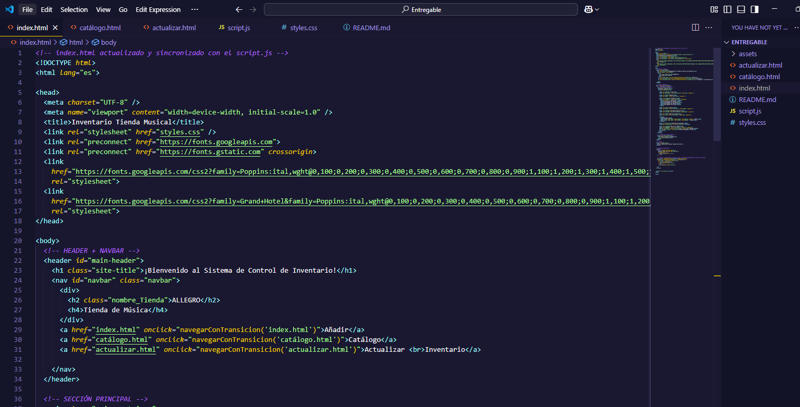
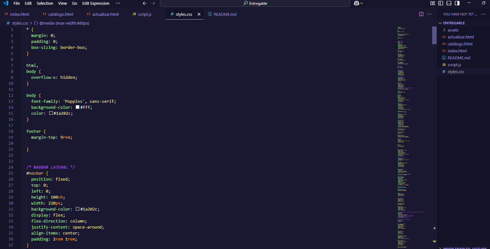
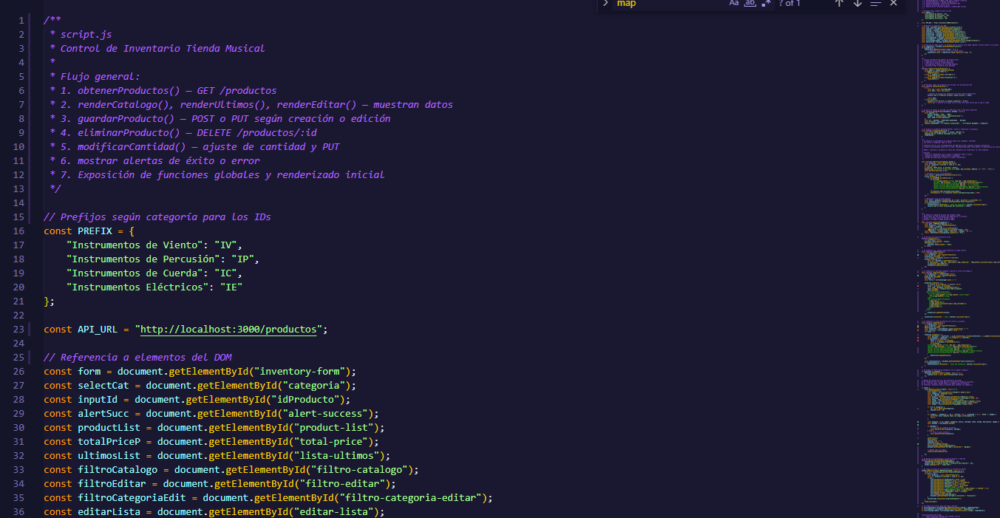
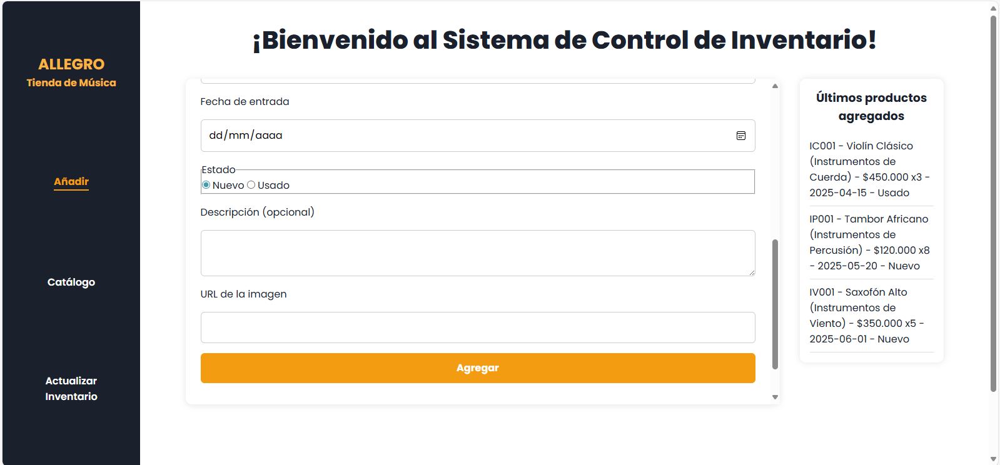
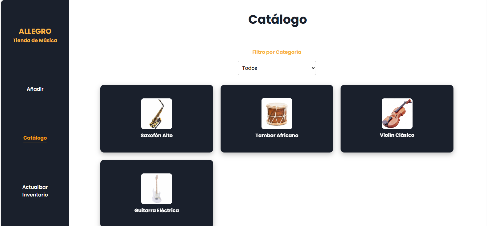
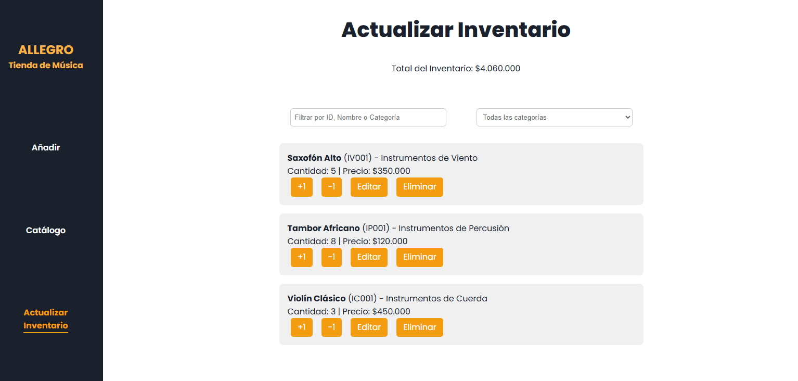

# 💻​ Sistema de Inventario para Tienda Musical - ALLEGRO





> Sistema de control de inventario para una tienda musical. Permite agregar, visualizar y editar () productos de manera dinámica utilizando HTML, CSS y JavaScript con almacenamiento en localStorage.





---

## 🔗 Demo en Vivo

🚧 *([agregar URL Netlify](https://snazzy-monstera-3e1644.netlify.app/))*

---

## 🛠️ Tecnologías Utilizadas

- HTML5 semántico
- CSS3
- JavaScript Vanilla (ES6+)
- LocalStorage para persistencia de datos

---

## 🧪 Cómo ejecutar el proyecto
Clona este repositorio:

bash
Copiar
Editar
git clone (https://github.com/vcmvanesa7/Sistema_control_inventario.git)
Abre cualquiera de las páginas (index.html, catálogo.html, actualizar.html) en tu navegador favorito.

Listo, ¡empieza a añadir productos!


```

---

## 📁 Estructura del Proyecto

```
/
├── index.html               # Página principal para añadir productos
├── catálogo.html            # Página visualización y filtro del catálogo existente
├── actualizar.html          # Página para editar/eliminar productos
├── styles.css               # Estilos generales y responsive
├── script.js                # Lógica y manipulación DOM
└── assets/
    └── img/                 # Imágenes del catálogo (URLs externas en este caso), capturas proyecto
```

---

## ✨ Características

- Generación automática de IDs por categoría
- Formulario validado con feedback visual
- Lista de últimos productos añadidos con animación
- Catálogo visual con tarjetas reversibles
- Filtro por categoría
- Página de edición con filtros por nombre, ID o categoría
- Cálculo dinámico del total del inventario
- Interfaz moderna y adaptable a cualquier dispositivo
- Alerta visual de éxito al agregar productos
- Limpieza del localStorage posible desde la consola con:
  ```js
  localStorage.clear()
  ```

---

## 🎨 Diseño y UX

- Interfaz centrada en facilidad de lectura
- Navegación lateral fija (navbar vertical)
- Scroll delimitado en secciones para mejorar la experiencia
- Responsive para móviles, tablets y pantallas grandes
- Paleta de colores sobria: blanco, gris oscuro, amarillo dorado

---

## 🧠 Aprendizajes

Durante el desarrollo de este proyecto se reforzaron los conocimientos en:

- Manejo de objetos, `Set` y `Map`
- Uso de bucles `for...in`, `for...of` y `forEach`
- Manipulación del DOM de forma eficiente
- Uso de localStorage para persistencia
- Organización de código en múltiples archivos HTML reutilizando JS

---

## 🚀 Mejoras Futuras

- Agregar autenticación para usuarios administradores
- Exportar e importar el inventario en formato JSON o CSV
- Integrar base de datos real y backend
- Imágenes alojadas localmente en carpeta `/assets/img/`

---

## 🙏 Créditos

- Tipografías: [Google Fonts](https://fonts.google.com/)
- Capturas: propias
- Inspiración en software de inventario clásicos

---

## 📚 Proyecto Académico
Este proyecto fue desarrollado como parte del entrenamiento en desarrollo web con RIWI – Talento Tech, con fines educativos y de práctica profesional.

Está diseñado para reforzar conceptos fundamentales de HTML, CSS y JavaScript a través de la creación de una aplicación funcional de inventario para una tienda musical.

## 🤝 Contribuciones y uso
Puedes clonar, estudiar, modificar y compartir este repositorio libremente.
Si decides usar este proyecto como base para tus propios aprendizajes o ejercicios, ¡me encantaría verlo!

#  📌 Nota
Este proyecto no está destinado a producción comercial, sino a la práctica de habilidades técnicas dentro de un entorno de formación.
Sin embargo, todo el código está disponible bajo la Licencia MIT, por lo que puedes usarlo en tus propios proyectos respetando dicha licencia.

## 📄 Licencia
Este proyecto está bajo la Licencia MIT.

---

⭐️ Desarrollado por **Vanesa Carrillo** — ¡Gracias por revisar mi trabajo! ⭐️
